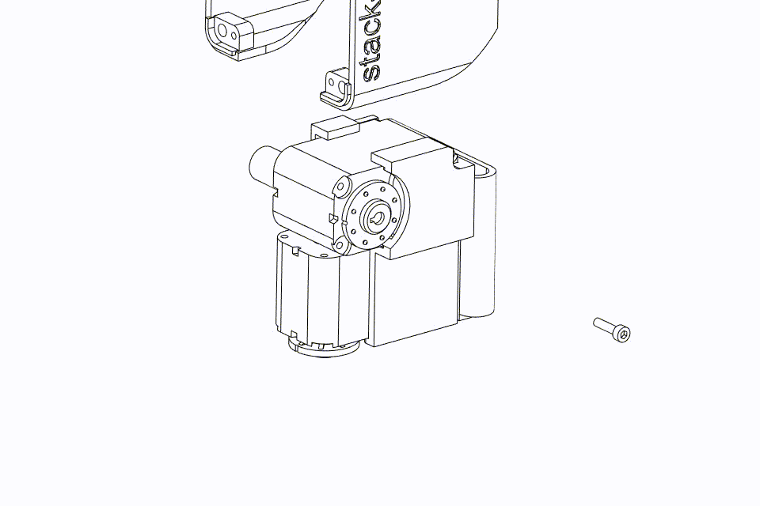

# ｽﾀｯｸﾁｬﾝ ケース

[Enblish](./README.md)

現在、[ケースデータ](https://a360.co/3gcw960)はFusion360で作成しています。

## 組み立て

### パーツ

* 3Dプリントしたケース
  * 外殻(Shell)
  * 足(Feet)
  * ブラケット(Bracket)
  * バッテリーケース(Battery backpack)
* M5Stack Core (Basic/Gray/Go/Fireのいずれか), またはCore2
* [Stack-chan 基板](../schematics/README.md)
* サーボモータ2つ
  * 現在次のモータで動作確認しています
    * [シリアルサーボ RS30Xシリーズ(TTL通信)](https://www.vstone.co.jp/robotshop/index.php?main_page=product_info&products_id=2685)
    * [シリアルサーボ SCS0009(TTL通信)](https://www.switch-science.com/catalog/8042/) serial servo
    * [PWMサーボ SG-90](https://akizukidenshi.com/catalog/g/gM-08761/)
* PH 2ピンのケーブル付きの3.7Vバッテリー
  * 以下で動作確認しています
    * [400mAhのリチウムポリマーバッテリー](https://www.sengoku.co.jp/mod/sgk_cart/detail.php?code=EEHD-4YZL)
    * [640mAhのリチウムポリマーバッテリー](https://www.sengoku.co.jp/mod/sgk_cart/detail.php?code=EEHD-5GHY))
* ねじ
  * M2 4mm * 4本
  * M2 8mm * 2本
  * （オプション）M3 15mm * 2本

### 組み立て方

(RS304MDを使った場合です。SG-90も似ています)

#### ブラケット

* サーボをブラケットに差し込みます。
  * シリアルサーボの場合、足側（左右回転）がID: 1のサーボ、顔側（上下回転）がID: 2のサーボになります。
* バッテリーをバッテリーケースに差し込みます。
* 爪を引っ掛けるようにしてバッテリーケースをブラケットに差し込みます。

#### 外殻と足

* ねじで足と外殻を固定します(それぞれM2-8mm * 1本)

#### M5Stackと基板

* サーボとバッテリーのケーブルを基板に接続します。コネクタの向きが正しいか確認してください。
* 基板をねじで固定します(M2-4mm * 4本)。
* M5Stackをロボットにスタックします。
* M5Stackを固定する場合、下側の2つの穴を使ってねじで固定します(M3-15mm * 2本)
