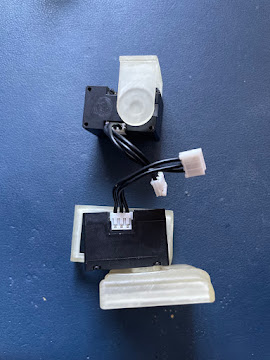
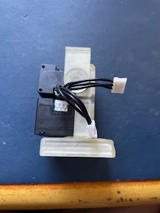
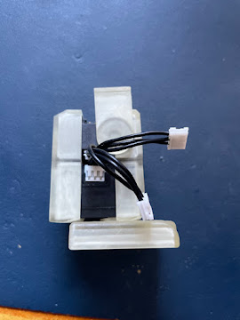

# スタックチャン ケース v1.0

日本語 | [English](./dynamixel.md)
## 必要なもの（DYNAMIXEL版）

1. 基板 x1
2. M5 Stack CoreS3 x1
3. horn x1
4. shell x1
5. gear_XL330 x2
6. backpack
7. bracket_XL330_f x1
8. bracket_XL330_b x1
9. M2x4mm なべタッピングネジ x4
10. feet_top x1
11. feet_bottom x1
12. M2.5x6mm バインドタッピングネジ x2(XL330に付属)
13. 4cm 通信ケーブル x2
14. XL330 x2

### XL330のIDと通信レートの変更

XL330のIDと通信レートの変更にはROBOTISのDynamixel Wizard2を使用します。PCとXL330を接続するには以下の機材が必要になります。

#### XL330以外で必要になるもの

- [U2D2](https://www.rt-shop.jp/index.php?main_page=product_info&products_id=3618)
- [SMPS2Dynamixel](https://www.rt-shop.jp/index.php?main_page=product_info&products_id=523)
- 5VのACアダプタ

#### Dynamixel wizard2をインストール

[emanual.robotis](https://emanual.robotis.com/docs/en/software/dynamixel/dynamixel_wizard2/)のsoftware DownloadにあるLinuxをクリックするとダウンロードします。
アクセス権に実行をつけてダブルクリックするとインストールが開始します。

#### IDと通信レートの値

XL330のデフォルト設定はID=1,Baud Rate=57600です。これをｽﾀｯｸﾁｬﾝのプログラムに合わせて次のように変更します。

|  | ID | Baud Rate |
|--|----|-----|
| 足のサーボ    | 1  | 1M  |
| 首振りのサーボ | 2  | 1M  |

### IDと通信レートを書き換える手順

1. Optionsをクリックして、XL330と接続しているUSBを選択します。
2. ScanをクリックするとXL330が画面左に表示されて通信できるようになります。
3. 画面左からXL330を選択します。
4. IDとBaud Rateを変更します。それぞれ項目をクリックし、右下のセレクトボックスから「1000000bps」を選択、Saveボタンを押してパラメータを反映します。

**注意**: 同じIDのサーボを複数つなぐことはできません。IDの書き換え時はサーボを一つずつ接続する必要があります。

## 組み立て手順

### 足のサーボの組み立て

- gear_xl330（小さい十字の部品）を、id=1のサーボに差し込みます。XL330のギアの突起と穴の位置を合わせてください（写真参照）。

- feet_topに差し込みます。十字のうち切り欠きがある突起が正面です。差し込んだら裏からM2.5x6mmのタッピングネジで固定します。
- feet_bottomをスライドして入れます。

### 首振りサーボの組み立て

- 足のサーボと同じように、gear_xl330をid=2のサーボに差し込みます。
- M2.5x6mmのタッピングネジで固定します。
- hornを取り付けます。

### ボディの組み立て

1. サーボのケーブルを取り付けます。

2. bracket_XL330_f を使って上下のサーボを組み合わせます。

3. bracket_XL330_bを使って上下のサーボを固定します。

4. 基板とサーボをケーブルで接続します。

5. shellにhornをスライドして入れます。

6. 基板とShellを2x4mm なべタッピングネジで4箇所固定します。

7. M5Stack本体をはめ込みます。

_完成!_
